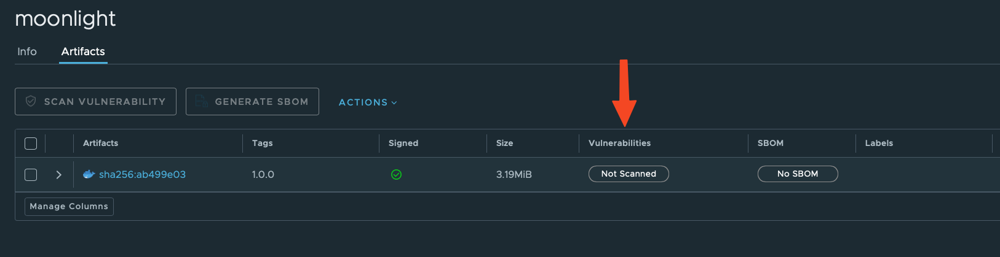
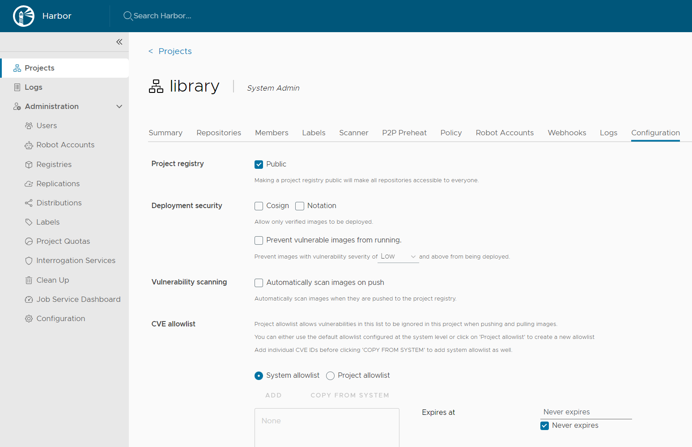
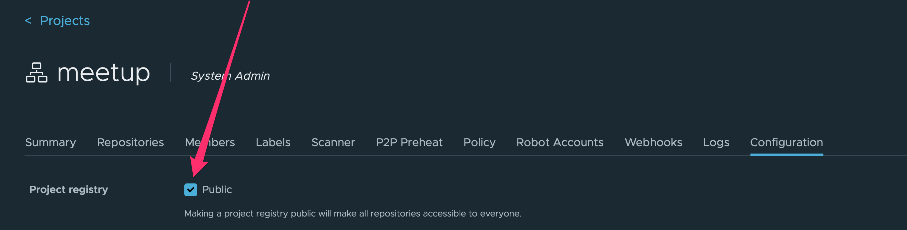
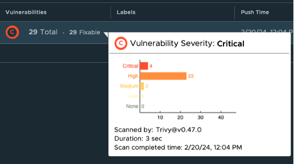

# ITTour - BurgasConf 2024 Jul

## 0. Pre-requisites


## 0.1 Offline setup

For doing the workshop exercises offline we'll need a Virtual Machine based on `Ubuntu 24.04`. We can create one, using
any of the freely available desktop hypervisors:

Free and Open Source:

- [VirtualBox](https://www.virtualbox.org)

Free for personal use:
> Note: Both VMware Workstation Pro and Fusion Pro are now free for personal use. More details you can find [here](https://blogs.vmware.com/workstation/2024/05/vmware-workstation-pro-now-available-free-for-personal-use.html)

- [VMware Workstation Pro](https://support.broadcom.com/group/ecx/productdownloads?subfamily=VMware+Workstation+Pro)
- [VMware Fusion Pro](https://support.broadcom.com/group/ecx/productdownloads?subfamily=VMware+Fusion)

Build-in Virtualization:

- Hyper-V in Windows 11 Pro or Enteprise
- KVM/XEN in Linux Desktops

To save some time (and effort), we can use [Vagrant](https://www.vagrantup.com) to automate the creation fo the VM.
Vagrant by HashiCorp is an easy to use tool that allow us to quickly create a Virtual Machine based development
environments using automation.

> Note: We are not going to spend much time explaining Vagrant in details here, but if you have any questions/problems
> please ask.

If you want to learn more about Vagrant a good starting point is their [Get Started](https://developer.hashicorp.com/vagrant/tutorials/getting-started)
tutorial.

## 0.2 Lab VM setup using Vagrant

- Install [Vagrant](https://developer.hashicorp.com/vagrant/docs/installation)
- Make sure your desktop Virtualization software is configured
- Create a `Vagrantfile`
- Run `vagrant up` and wait for the VM to be up and running.

Lets start by creating the Vagrantfile:

```shell
~$ cat Vagrantfile
```

```ruby
Vagrant.configure("2") do |config|
  config.vm.box = "bento/ubuntu-24.04"
  config.vm.box_version = "202404.26.0"
end
```

More details about the Vagrant Box that we'll be using you can find  [here](https://app.vagrantup.com/bento/boxes/ubuntu-24.04)
Next, we are going to create the lab VM using `vagrant up`:

> Note: The output on your machine might differ based on the platform and hypervisor you are using

```bash
~$ vagrant up
```

```shell
Bringing machine 'default' up with 'vmware_desktop' provider...
==> default: Box 'bento/ubuntu-24.04' could not be found. Attempting to find and install...
    default: Box Provider: vmware_desktop, vmware_fusion, vmware_workstation
    default: Box Version: 202404.26.0
==> default: Loading metadata for box 'bento/ubuntu-24.04'
    default: URL: https://vagrantcloud.com/api/v2/vagrant/bento/ubuntu-24.04
==> default: Adding box 'bento/ubuntu-24.04' (v202404.26.0) for provider: vmware_desktop (arm64)
    default: Downloading: https://vagrantcloud.com/bento/boxes/ubuntu-24.04/versions/202404.26.0/providers/vmware_desktop/arm64/vagrant.box
==> default: Successfully added box 'bento/ubuntu-24.04' (v202404.26.0) for 'vmware_desktop (arm64)'!
==> default: Cloning VMware VM: 'bento/ubuntu-24.04'. This can take some time...
==> default: Checking if box 'bento/ubuntu-24.04' version '202404.26.0' is up to date...
==> default: Verifying vmnet devices are healthy...
==> default: Preparing network adapters...
==> default: Starting the VMware VM...
==> default: Waiting for the VM to receive an address...
==> default: Forwarding ports...
    default: -- 22 => 2222
==> default: Waiting for machine to boot. This may take a few minutes...
    default: SSH address: 127.0.0.1:2222
    default: SSH username: vagrant
    default: SSH auth method: private key
    default:
    default: Vagrant insecure key detected. Vagrant will automatically replace
    default: this with a newly generated keypair for better security.
    default:
    default: Inserting generated public key within guest...
    default: Removing insecure key from the guest if it's present...
    default: Key inserted! Disconnecting and reconnecting using new SSH key...
==> default: Machine booted and ready!
==> default: Configuring network adapters within the VM...
==> default: Waiting for HGFS to become available...
==> default: Enabling and configuring shared folders...

~$
```

```shell
~$ vagrant box list
bento/ubuntu-24.04 (vmware_desktop, 202404.26.0, (arm64))

~$ vagrant status default
Current machine states:

default                   running (vmware_desktop)

The VM is running. To stop this VM, you can run `vagrant halt` to
shut it down, or you can run `vagrant suspend` to simply suspend
the virtual machine. In either case, to restart it again, run
~$
```

```shell
~$ vmrun list

Total running VMs: 1
Total running VMs: 1
~/dojolabs/.vagrant/machines/default/vmware_desktop/172785f5-4122-4d7e-968d-29e49243385b/ubuntu-24.04-aarch64.vmx
~$
```
Now we have our linux machine lets ssh inside it. With `vagrat` is very simple just use the command below:

```bash
~/demo$ vagrant ssh

Welcome to Ubuntu 24.04 LTS (GNU/Linux 6.8.0-31-generic aarch64)

 * Documentation:  https://help.ubuntu.com
 * Management:     https://landscape.canonical.com
 * Support:        https://ubuntu.com/pro

 System information as of Thu Jul  4 11:04:26 AM UTC 2024

  System load:  0.0                Processes:             252
  Usage of /:   10.7% of 29.82GB   Users logged in:       0
  Memory usage: 3%                 IPv4 address for eth0: 192.168.59.149
  Swap usage:   0%
```

### 0.2.1 Clone repo

Lets clone the repo with all the necessary files

```bash
~$ git clone git@github.com:DojoBits/burgasconf-2024-jul.git
Cloning into 'burgasconf-2024-jul'...

```

Lets move the demo directory to our home directory and change to it.

```bash
~$ mv burgasconf-2024-jul/demo .
~$ cd demo/
~/demo$
```

### 0.3 Install Cosign

Before we start let's do some small VIM optimization

```bash
$ echo "set number" >> ~/.vimrc
$ echo "set paste" >> ~/.vimrc
```

We will install `cosign` which is a tool for signing and verifying container images. We will use it to sign our images.

```bash
# dkpg get machine arch
ARCH=$(dpkg --print-architecture)
# Install latest cosign
LATEST_VERSION=$(curl https://api.github.com/repos/sigstore/cosign/releases/latest | grep tag_name | cut -d : -f2 | tr -d "v\", ")
curl -O -L "https://github.com/sigstore/cosign/releases/latest/download/cosign_${LATEST_VERSION}_${ARCH}.deb"
sudo dpkg -i cosign_${LATEST_VERSION}_${ARCH}.deb
```

### 0.4 Install Kubernetes

We will use our simple script to install `kubernetes` and `cilium` on our VM. You can download or open it in the browser
to check it out if you don't want to run it like that. The script will use `containerd` as a container runtime which
means `Docker` will not be installed. We will do that in the next step.


```bash
~$ wget -qO - https://raw.githubusercontent.com/DojoBits/Toolbox/main/k8s-up.sh | sh

net.bridge.bridge-nf-call-ip6tables = 1
net.bridge.bridge-nf-call-iptables = 1
net.ipv4.ip_forward = 1
* Applying /usr/lib/sysctl.d/10-apparmor.conf ...
* Applying /etc/sysctl.d/10-console-messages.conf ...
* Applying /etc/sysctl.d/10-ipv6-privacy.conf ...
* Applying /etc/sysctl.d/10-kernel-hardening.conf ...
* Applying /etc/sysctl.d/10-magic-sysrq.conf ...
* Applying /etc/sysctl.d/10-map-count.conf ...
* Applying /etc/sysctl.d/10-network-security.conf ...

...

cilium-linux-amd64.tar.gz: OK
cilium
~$
```

### 0.5 Install Docker

We will use `Docker` to build our container images and push them to the `Harbor` registry. Because we already have the
correct APT repository for `Docker` we can install it with the following command.

```bash
~$ sudo apt-get install docker-ce docker-ce-cli docker-buildx-plugin docker-compose-plugin -y
Reading package lists... Done
Building dependency tree... Done
Reading state information... Done
The following additional packages will be installed:
  docker-ce-rootless-extras libltdl7 libslirp0 pigz slirp4netns
Suggested packages:
  cgroupfs-mount | cgroup-lite
The following NEW packages will be installed:
  docker-buildx-plugin docker-ce docker-ce-cli docker-ce-rootless-extras
  docker-compose-plugin libltdl7 libslirp0 pigz slirp4netns
0 upgraded, 9 newly installed, 0 to remove and 64 not upgraded.
Need to get 75.3 MB of archives.
After this operation, 278 MB of additional disk space will be used.
Do you want to continue? [Y/n] y
Get:1 http://ports.ubuntu.com/ubuntu-ports noble/universe arm64 pigz arm64 2.8-1 [60.7 kB]
Get:2 https://download.docker.com/linux/ubuntu noble/stable arm64 docker-buildx-plugin arm64 0.15.1-1~ubuntu.24.04~noble [27.3 MB]
Get:3 http://ports.ubuntu.com/ubuntu-ports noble/main arm64 libltdl7 arm64 2.4.7-7build1 [40.4 kB]
...
...
Processing triggers for man-db (2.12.0-4build2) ...
Processing triggers for libc-bin (2.39-0ubuntu8.1) ...
Scanning processes...
Scanning linux images...

Running kernel seems to be up-to-date.

No services need to be restarted.

No containers need to be restarted.

No user sessions are running outdated binaries.

No VM guests are running outdated hypervisor (qemu) binaries on this host.
```

Lets add our user to the docker group so we don't use `sudo` all the time.

```bash
~/demo$ sudo usermod -aG docker $(whoami)
~/demo$ newgrp docker
```

If you like auto-completion, don't forget this which will do two things. Remember this is the first thing in the
Kubernetes cheatsheet: [kubernetes cheatsheet](https://kubernetes.io/docs/reference/kubectl/cheatsheet/).

- Add the completion script to your `.bashrc` file
- Add an alias for `kubectl` to `k` ( optional ). If you don't want to use 'k' just use the full command `kubectl`.

```
echo "source <(kubectl completion bash)" >> ~/.bashrc
echo "alias k=kubectl" >> ~/.bashrc
echo "complete -F __start_kubectl k" >> ~/.bashrc
source ~/.bashrc
```

Lets verify the Kubernetes installation:

```bash
~/demo$ k get nodes
NAME     STATUS   ROLES           AGE     VERSION
ubuntu   Ready    control-plane   3m49s   v1.30.2

```

Everything looks good lets continue

### 1.0 Harbor demo

We will use the official https://demo.goharbor.io/ from [official
doc](https://goharbor.io/docs/1.10/install-config/demo-server/) you can find that __The demo server is cleaned and reset
every two days.__ so you can use it for your tests but don't count on it for long term.

Lets create an account. Navigate to [Demo Harbor](https://demo.goharbor.io/)


Click on `Sign Up` and fill the form there is no need of verification. For our demo we will setup a user `burgas` and a
password `Burgasconf123`

Create a new project and name it whatever you want. For our demo we use `burgas` ( same as the account name )

### 1.1 Docker login to registry

To push images to the `Harbor` registry we need to login. We will use our account name `burgas` and password
`Burgasconf123`

```bash
~/demo$ docker login demo.goharbor.io
Username: burgas
Password:
WARNING! Your password will be stored unencrypted in /home/ubuntu/.docker/config.json.
Configure a credential helper to remove this warning. See
https://docs.docker.com/engine/reference/commandline/login/#credentials-store

Login Succeeded

```

All good we are logged in. Let's move on.

### 1.2 Create an image

Build an image from repo provided `Dockerfile` with a simple `alpine` container image and tag it. This image is latest
alpine and there is no critical vulnerabilities.

```bash
~/demo$ cat Dockerfile
FROM alpine:3.20.1
ENTRYPOINT ["sleep", "1000"]
```

Lets build the image

```bash
~/demo$ docker build -t demo.goharbor.io/burgas/moonlight:1.0.0 .
```

#### 1.3 Push it to the Harbor

Let's push the image to the Harbor

```bash
~$ docker push demo.goharbor.io/burgas/moonlight:1.0.0

The push refers to repository [demo.goharbor.io/burgas/moonlight]
b09314aec293: Pushed
3.0.0: digest: sha256:eb6b7c17ba2ece109f5548e95a90a0b104bc44aeb1f8b30b9eafa2e5de1c420c size: 527
```

Now lets check the `Harbor` UI and see if our image is there and is it signed or scanned. Open [Demo Harbor](https://demo.goharbor.io/)

#### 2.0 Sign the image

To sign our image using `cosign` we will need to generate a key pair first. If we choose to use `openID` as a method of
authentication later when we configure Kyverno we will need additional service handling that. For that reason we will
keep it simple and use long lived ( not recommended ) key pair.

Lets generate a key pair. Put some password but remember it because you will need it later for the lab i will use
`123123`.

```bash
~/demo$ cosign generate-key-pair

Enter password for private key:
Enter password for private key again:
Private key written to cosign.key
Public key written to cosign.pub
```

Tags are immutable and they point to specific commit. You cannot change the tag to point to a different commit. The
problem is you can delete and create a new tag with the same name and point to a different commit. This is why we will
use the image digest to sign the image. The digest is a `sha256` hash of the image and it is unique for each image. You
cannot change the digest of an image. That is why we will use the digest to sign the image.


We will get the image digest and store it in a variable for later use.

```bash
~/demo$ DIGESTS=`docker images --digests | grep moonlight | grep 1.0.0 | awk '{print $3}'`
~/demo$ echo $DIGESTS
sha256:eb6b7c17ba2ece109f5548e95a90a0b104bc44aeb1f8b30b9eafa2e5de1c420c
```
Sign the image using the `cosign` private key we generated earlier.

```bash
~/demo$ cosign sign --key cosign.key demo.goharbor.io/burgas/moonlight@${DIGESTS}

WARNING: "demo.goharbor.io/burgas/moonlight" appears to be a private repository, please confirm uploading to the transparency log at "https://rekor.sigstore.dev"
Are you sure you would like to continue? [y/N] y
...

Are you sure you would like to continue? [y/N] y
tlog entry created with index: 72407934
Pushing signature to: demo.goharbor.io/burgas/moonlight

```

If you wan to check our your signing we can open `Rekor` at [Search Rekor](http://search.sigstore.dev). Now we can use
your email or you can get the `tlog` index from the output of the `cosign sign` command. In our case that is `72407934`.
Go ahead try it out get the index and put it in the search bar just change the attribute to `tlog` and you will see the
the signature.

Open [Demo Harbor](https://demo.goharbor.io/) navigate to your project and you will see that the image is signed. You can see the small
green icon now next to the image showing us that there is a signature.

### 1.3 Harbor scanning images

You can see that the image is not scanned  we can scan the image manually or make a
configuration in `Harbor` to scan the image on push. Bare with us we will do that in the next steps.

### 1.4 Build vulnerable image

Lets build an image with vulnerable software. We will use `Dockerfile-vuln` which use older `alpine` image which is
vulnerable

```bash
~/demo$ docker build -f Dockerfile-vuln -t demo.goharbor.io/burgas/moonlight-vuln:1.0.0 .
```

Push the images to your project in Harbor.

```
~$ docker push demo.goharbor.io/burgas/moonlight-vuln:1.0.0
Pushing image to demo.goharbor.io/burgas/moonlight-vuln:1.0.0
```

Let's check some `Harbor` project settings and:



- Keep the registry private or make it public
- Allow only signed images to be pulled with `cosign` or `Notation` a.k.a. `notary`
- Prevent vulnerable images from being pulled and we can set the severity level of the vulnerabilities that we want to
  prevent from being pulled.
- Automatically scan images on push

All set now its time to install `Kubernetes` and `Helm` and `Kyverno` and use them to enforce policies from `Kubernetes`

### 2.0 Harbor private repository

```bash
~/demo$ k create secret docker-registry harbor-credentials \
--docker-server=demo.goharbor.io \
--docker-username=burgas \
--docker-password='Burgasconf123' \
--docker-email=your_email@example.com
```


### 2.1 Install Kyverno

A dynamic admission controller for Kubernetes. We will use it to enforce policies.

```bash
~/demo$ helm repo add kyverno https://kyverno.github.io/kyverno/
~/demo$ helm install kyverno kyverno/kyverno -n kyverno --create-namespace
```

Lets check the installation:

```bash
~/demo$ k get pods -n kyverno
NAME                                             READY   STATUS    RESTARTS   AGE
kyverno-admission-controller-69f8479f84-j9rnr    1/1     Running   0          48s
kyverno-background-controller-7b6c6c8574-d26tr   1/1     Running   0          48s
kyverno-cleanup-controller-754bc5976f-qrzxs      1/1     Running   0          48s
kyverno-reports-controller-66d88fc55b-k86h7      1/1     Running   0          48s
```

Good, everything looks good.

### 2.2 Kyverno policies

We will use `kyverno` to enforce that all images are signed. `Kyverno` will use `cosign` public key to verify the
signature of the images.

We need to get the `cosign.pub` key which we will add in our policy. In production we keep our secrets in `KMS ( Key
Management Service )` like Hashicorp Vault, AWS KMS, Azure Key Vault, Google Cloud KMS etc. For our demo we keep it
simple.

```bash
~/demo$ cat cosign.pub
-----BEGIN PUBLIC KEY-----
MFkwEwYHKoZIzj0CAQYIKoZIzj0DAQcDQgAEsYce/B39gE5focMAnDWf5saXsvzh
lzgDNilMRKqg94/dGc8cYAmSQNa6i2AoQWueXUWSG6+SkdL2nT0NkgH1hw==
-----END PUBLIC KEY-----
```

Here is our policy. Don't forget to replace `demo.goharbor.io/burgas/*` with your project name and `cosign.pub` key with
the one you generated earlier.

> Inside `vim` you can use :r cosign.pub to read the file content and insert it in the yaml file. Be careful with the
spaces and tabs in the yaml file.

```bash
~demo$ vim kp.yaml && cat $_
```
```yaml
apiVersion: kyverno.io/v1
kind: ClusterPolicy
metadata:
  name: verify-image-signature
spec:
  validationFailureAction: Enforce
  background: false
  rules:
    - name: check-image-signature
      match:
        any:
        - resources:
            kinds:
              - Pod
      verifyImages:
      - image: "demo.goharbor.io/burgas/*" # 'burgas' is our project name
        key: |- # This is our cosign.pub key we generated earlier
          -----BEGIN PUBLIC KEY-----
          MFkwEwYHKoZIzj0CAQYIKoZIzj0DAQcDQgAEsYce/B39gE5focMAnDWf5saXsvzh
          lzgDNilMRKqg94/dGc8cYAmSQNa6i2AoQWueXUWSG6+SkdL2nT0NkgH1hw==
          -----END PUBLIC KEY-----
```

Apply the policy into the cluster.

```bash
~$ k apply -f kp.yaml
clusterpolicy.kyverno.io/verify-image-signature created
```

I don't trust myself that's why I always verify what I'm doing. Here is a verification step.

```bash
~$ k get clusterpolicy -n kyverno
NAME                     ADMISSION   BACKGROUND   VALIDATE ACTION   READY   AGE   MESSAGE
verify-image-signature   true        false        Enforce           True    34s   Ready
```

You can use `kubectl describe` for full details

```bash
~$ k describe clusterpolicy -n kyverno
Name:         verify-image-signature
Namespace:
Labels:       <none>
Annotations:  <none>
API Version:  kyverno.io/v1
Kind:         ClusterPolicy
Metadata:
  Creation Timestamp:  2024-07-04T13:43:47Z
.
.
.

```

It's time to create a pod that will violate our policy. Why ? Because we will use an unsigned image.
If you remember we created two images`moonlight` and `moonlight-vuln`. The first one is signed and the second one is
not signed. We will use the second one to violate our policy. The vulnerabilities does not matter for now.

### 3.0 Try creating a Pod

Please make sure the project is public. You can do that from the `Harbor` UI.



Now we are sure that `kyverno` can pull the image from the `Harbor` registry. We can create a pod with the `moonlight`


```bash
~/kyverno$ vim pod.yaml && cat $_
```
```yaml
apiVersion: v1
kind: Pod
metadata:
  labels:
    run: pod-not-signed
  name: pod-not-signed
spec:
  containers:
  - image: demo.goharbor.io/burgas/moonlight-vuln:1.0.0
    name: pod-not-signed
```

### 3.1 Create the pod

Now we can try to create our pod and see what actually happens.

```bash
~/kyverno$ k apply -f pod.yaml
Error from server: error when creating "pod.yaml": admission webhook "mutate.kyverno.svc-fail" denied the request:

resource Pod/default/pod-not-signed was blocked due to the following policies

verify-image-signature:
  check-image-signature: 'failed to verify image demo.goharbor.io/burgas/moonlight-vuln:1.0.0:
    .attestors[0].entries[0].keys: no matching signatures'
```

As you can see our image was not signed and the pod was not created. Lets try with a signed image.
Now we will use the `moonlight` image which is signed.

```bash
~/kyverno$ vim pod-signed.yaml && cat $_
```
```yaml
apiVersion: v1
kind: Pod
metadata:
  labels:
    run: pod-signed
  name: pod-not-signed
spec:
  containers:
  - image: demo.goharbor.io/burgas/moonlight:1.0.0
    name: pod-signed
```

Now we can try to create our pod and see what actually happens.

```bash
~/kyverno$ k apply -f pod-signed.yaml
pod/pod-not-signed created
ubuntu@ip-172-31-17-242:~/kyverno$ k get pods
NAME             READY   STATUS    RESTARTS   AGE
pod-signed   1/1     Running   0          5s
```

As you can see the pod was created successfully. That is how easy it is to enforce policies with `kyverno`. Now we can
be sure that our running pods are using only signed images.

## 4. Run only scan images

In this section of the demo we will create a new policy which will enforce that all images are scanned. That way we will
be sure that our images are scanned before they are used. We can elaborate here discuss the severity because the policy
will not save you from running image with `critical` vulnerabilities.

We assume here that you enable the `Harbor` feature to scan images on push. That mean's that every time you push an
image `Harbor` will scan it using `Trivy` ( or other scanner you configured ) and will provide a result.



## 4.1 Kyverno policy for scan check

This is our policy for `kyverno` to check if the image was scanned and the scan is not older than 12 hours.

```bash
~/kyverno$ vim kp-trivy.yaml && cat $_
```
```yaml
apiVersion: kyverno.io/v1
kind: ClusterPolicy
metadata:
  name: check-vulnerabilities-scan
spec:
  validationFailureAction: Enforce
  background: false
  webhookTimeoutSeconds: 30
  failurePolicy: Fail
  rules:
    - name: checking-vulnerability-scan
      match:
        any:
        - resources:
            kinds:
              - Pod
      verifyImages:
      - imageReferences:
        - "*"
        attestations:
        - type: https://cosign.sigstore.dev/attestation/vuln/v1
          conditions:
          - all:
            - key: "{{ time_since('','{{ metadata.scanFinishedOn }}', '') }}"
              operator: LessThanOrEquals
              value: "12h"
          attestors:
          - count: 1
            entries:
            - keys:
                publicKeys: |- # This is our cosign.pub key
                  -----BEGIN PUBLIC KEY-----
                  MFkwEwYHKoZIzj0CAQYIKoZIzj0DAQcDQgAEsYce/B39gE5focMAnDWf5saXsvzh
                  lzgDNilMRKqg94/dGc8cYAmSQNa6i2AoQWueXUWSG6+SkdL2nT0NkgH1hw==
                  -----END PUBLIC KEY-----
```

### 4.2 Apply the policy

Lets apply the scanning `kyverno` policy.

```bash
~/kyverno$ k apply -f kp-trivy.yaml
```

Test with pod.

```bash
~/kyverno$ vim pod-scan.yaml && cat $_
```
```yaml
apiVersion: v1
kind: Pod
metadata:
  labels:
    run: pod-scanned
  name: pod-scanned
spec:
  containers:
  - image: demo.goharbor.io/burgas/moonlight:1.0.0
    name: pod-scanned
```

```bash
~/kyverno$ k apply -f pod-scan.yaml
```

The pod fails to start because it violates the policy. The image was not scanned and the scan is older than 12 hours.

But what happen `Harbor` actually scan the image the report is there why the pod fails to start. The reason is that the
Harbor does not put the scan report in the `metadata` of the image. This is an upcoming feature in `Harbor` which when
its in `GA` we can use the scanning report as attestations for our image and then Admission controller like `Kyverno` can
use it for enforcing policies.

What is the solution? We can use `cosign` to attach the scan report to the image.


### 4.3 Install trivy

We will use `trivy` to scan our images. `Trivy` is a simple and comprehensive vulnerability scanner for containers.

```bash
sudo apt-get install wget apt-transport-https gnupg lsb-release
wget -qO - https://aquasecurity.github.io/trivy-repo/deb/public.key | gpg --dearmor | sudo tee /usr/share/keyrings/trivy.gpg > /dev/null
echo "deb [signed-by=/usr/share/keyrings/trivy.gpg] https://aquasecurity.github.io/trivy-repo/deb $(lsb_release -sc) main" | sudo tee -a /etc/apt/sources.list.d/trivy.list
sudo apt-get update
sudo apt-get install trivy
```
### 4.4 Trivy scan image


With `Trivy` to scan  our image and save the report in a file.

```bash
~/kyverno$  trivy image --ignore-unfixed --format cosign-vuln --output scan.json demo.goharbor.io/burgas/moonlight:1.0.0
```

- --ignore-unfixed: Ensures only the vulnerabilities, which have a already a fix available, are displayed
- --output scan.json: The scan output is saved to a scan.json file instead of being displayed in the terminal.

### 4.5 Attach attestation to the image

This is where `cosign` comes in. We will use `cosign` to attach the scan report to the image. As you can see we use the
`attest` command to attach the scan report to the image. We use the `cosign.key` which is our private key that we
generate earlier to sign the image. This will automatically upload that to the image registry in our case `Harbor`.

```bash
~/kyverno$ cosign attest --key cosign.key --predicate scan.json --type vuln demo.goharbor.io/burgas/moonlight:1.0.0
```

Now our `trivy` report is attached to the image as attestations.

Lets try to create the    pod again. As you can see we will not touch the yaml file. We will use the same file that we used
in the previous step. The only difference is that now the image is scanned from our computer and the report is glued to
the image.

In prod we do that in our CICD we sign, scan and attach the scan report to the image. Now its time to try to run the pod
again.


```bash
:~/kuverno$ k apply -f pod.yaml
pod/pod-not-signed created
ubuntu@ip-172-31-17-242:~/kuverno$ k get pods
NAME             READY   STATUS    RESTARTS        AGE
pod-scanned   1/1     Running   3 (9m58s ago)   60m
```

As you can see the pod was created successfully. That is how easy it is to enforce policies with `kyverno`.

At the end we have two policies:

- A policy to enforce that all images are signed
- A policy to enforce that all images are scanned and the scan is not older than 12 hours

Before an image can run in our `Kubernetes` cluster it must be `signed` and `scanned` both of them. This is how we can
use Admission controllers to enforce our corporate policies.

Thank you.

@Valentin Hristev - https://www.linkedin.com/in/valentin-hristev/
